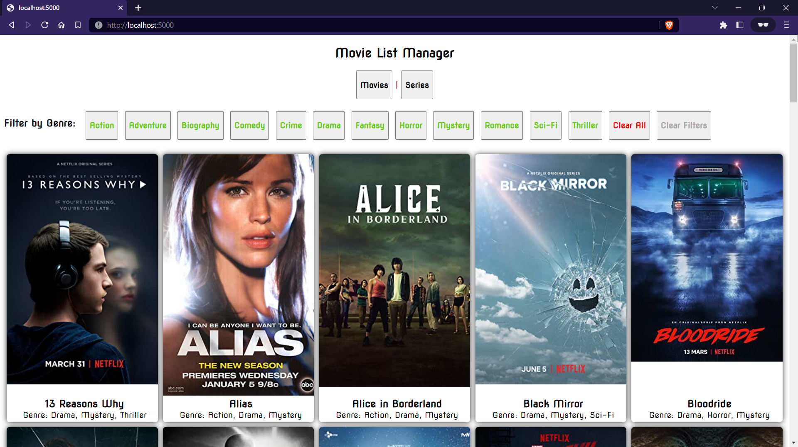

# Movie List Manager

Movie List Manager is a Node.js application which assists you in managing your list of movies and series.

It uses the [OMDb API](https://omdbapi.com/) to fetch details of the given titles and displays them in a HTML page.

The HTML page provides an interactive UI for the user to look at the details of the given titles sorted by movies | series and filtered by Genres.

Preview Image:

Preview Video:

https://user-images.githubusercontent.com/83070675/216808513-1db21342-488e-4f4c-bbc8-49f11e75ee03.mp4
